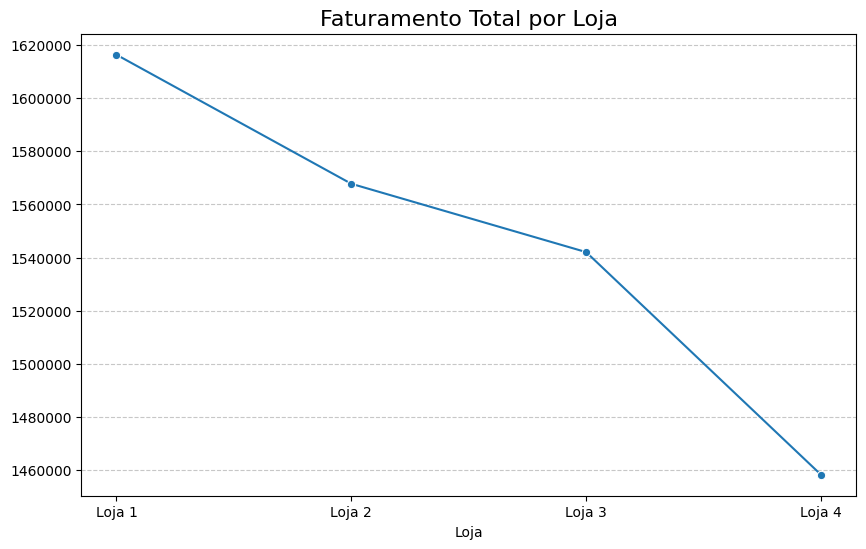

#  Challenge Alura - Análise de Lojas

> <p align="center">
>   >src="https://cdn.jsdelivr.net/gh/devicons/devicon/icons/python/python-original.svg" width="40" alt="Python" />
  
  
  
</p>

##  Objetivo do Projeto
Este projeto faz parte do Challenge de Data Science da Alura, onde realizamos uma análise detalhada de 4 lojas para determinar qual delas deve ser vendida, baseando-nos em métricas de desempenho financeiro e operacional.

## Dados Analisados

• Faturamento Total por Loja
- Loja 1: R$ 1.616.347  
- Loja 2: R$ 1.567.773  
- Loja 3: R$ 1.542.048  
- Loja 4: R$ 1.458.253  **(MENOR FATURAMENTO)**

• Média de Avaliações
- Loja 1: 3.98  
- Loja 2: 4.04  
- Loja 3: 4.05  **(MELHOR AVALIAÇÃO)**  
- Loja 4: 4.00  

• Frete Médio
- Loja 1: R$ 34.69  **(MAIS CARO)**  
- Loja 2: R$ 33.62  
- Loja 3: R$ 33.07  
- Loja 4: R$ 31.28  **(MAIS BARATO)**  

• Produtos
- Mais vendido geral: **TV Led UHD 4K** (R$ 607.367,22)  
- Menos vendido geral: **Cubo mágico 8x8** (R$ 3.922,00)  

## Recomendação Final
Loja 4 deve ser vendida

### Justificativa:
• Menor faturamento entre todas as lojas (R$ 1.458.253)  
• Diferença significativa de ~R$ 158.000 para a Loja 1  
• Apesar do frete mais baixo, não compensa o baixo faturamento  
• Avaliações medianas (4.00) não justificam manter a operação  

##  Visualizações
Nesta seção são apresentados **3 gráficos** utilizados para apoiar a análise e a tomada de decisão:

 Gráfico do **faturamento total por loja**
  
 Gráfico da **média de avaliações por loja**
 
 Gráfico do **frete médio por loja**
 

## 🔗 Notebook no Google Colab
O código completo da análise, incluindo tratamento de dados, cálculos e visualizações, está disponível no Google Colab:

**https://colab.research.google.com/drive/1LGyQnE7AEDGZFcAY1vNW8Zqf9jNMtm0W?usp=sharing**

##  Tecnologias Utilizadas
- Python  
- Pandas – Manipulação de dados  
- Matplotlib – Visualizações  
- Seaborn – Gráficos estatísticos  
- Google Colab – Ambiente de desenvolvimento  

## 📁 Estrutura do Projeto
```text
challenge-alura/
│
├── notebook/
│   └── Untitled0.ipynb          # Análise completa
│
├── data/
│   ├── loja_1.csv
│   ├── loja_2.csv
│   ├── loja_3.csv
│   └── loja_4.csv
│
└── README.md
